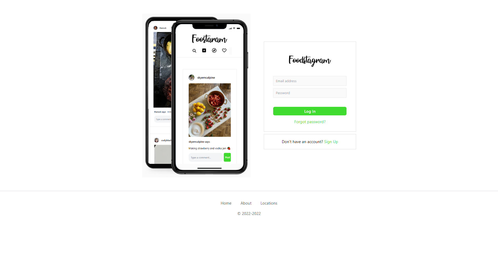

 

  

  <h3 align="center">Foodstagram</h3>

  

    Advanced Instagram Clone for Food
     
     
    <a href="https://github.com/ShaanCoding/Foodstagram"><strong>Explore the docs »</strong></a>
     
     
    <a href="https://github.com/ShaanCoding/Foodstagram">View Demo</a>
    .
    <a href="https://github.com/ShaanCoding/Foodstagram/issues">Report Bug</a>
    .
    <a href="https://github.com/ShaanCoding/Foodstagram/issues">Request Feature</a>
  

   

## Table Of Contents

- [Table Of Contents](#table-of-contents)
- [About The Project](#about-the-project)
- [Features](#features)
- [Built With](#built-with)
- [Getting Started](#getting-started)
  - [Installation](#installation)
- [Roadmap](#roadmap)
- [Contributing](#contributing)
  - [Creating A Pull Request](#creating-a-pull-request)
- [License](#license)
- [Authors](#authors)
- [Acknowledgements](#acknowledgements)

## About The Project

Welcome to Foodstagram! Our app is a clone of the popular photo sharing app Instagram, but with a focus on food. With Foodstagram, you can share photos and videos of your meals with your friends, and see what others are eating around the world. You can also search for specific foods, or find restaurants and cafes near you.

Whether you're a foodie or just looking for a new way to share your meals with friends, Foodstagram is the perfect app for you!

## Features

Some of the features of Foodstagram include:

- Login/Registeration & 2FA: With Foodstagram, you can login or register for an account using your email address or phone number. You can also enable Two-Factor Authentication (2FA) for additional security.

- Feed Page: The Feed Page is where you can see all the latest photos and videos from people you follow. You can also like, comment, and share posts from the Feed Page.

- Following Users: You can follow other users on Foodstagram to see their posts in your Feed. You can also view a list of the people you follow, and the people who follow you.

- Blocking Users: If you don't want to see posts from a particular user, you can block them on Foodstagram. Blocked users will not be able to see your posts or profile.

- Profile & Edit Profile Page: Your profile is a place to share a little bit about yourself, and to show off your food photos. On the Edit Profile Page, you can change your profile photo, bio, and other settings.

- View Business Posts Analytics: As a business, you can use Foodstagram to post photos and videos of your food. You can also view analytics to see how your posts are performing, and schedule future posts.

- Scheduling Business Posts: You can schedule business posts in advance on Foodstagram, so you never have to worry about missing a post.

- Managing Business Posts: You can manage your business posts on Foodstagram, and view comments and likes from customers.

- Creating Business Posts: You can create business posts on Foodstagram by adding photos and videos of your food. You can also add a caption, location, and tags to your posts.

- SearchUsers & Posts/Locations: You can search for specific users or posts on Foodstagram, or find restaurants and cafes near you.

## Built With

This section should list any major frameworks that you built your project using. Leave any add-ons/plugins for the acknowledgements section. Here are a few examples.

- [React](https://reactjs.org/)
- [Express](https://expressjs.com/)
- [Node.js](https://nodejs.org/en/)
- [postgreSQL](https://www.postgresql.org/)
- [tailwindcss](https://tailwindcss.com/)
- [Azure DevOps](https://azure.microsoft.com/en-us/services/devops/)
- [Github Actions](https://github.com/ShaanCoding/Foodstagram/actions)
- [React Testing Library](https://testing-library.com/docs/react-testing-library/intro/)
- [Jest](https://jestjs.io/)

## Getting Started

To use the app, simply go to the [production link](https://foodstagram.netlify.com) (Offline) and sign up for an account. Once you're logged in, you can start sharing photos and videos of your meals with your friends!

### Installation

Relevant instructions for the frontend and backend are in the respective `README.md` files.

## Roadmap

See the [open issues](https://github.com/ShaanCoding/Foodstagram/issues) for a list of proposed features (and known issues).

## Contributing

Contributions are what make the open source community such an amazing place to be learn, inspire, and create. Any contributions you make are **greatly appreciated**.

- If you have suggestions for adding or removing projects, feel free to [open an issue](https://github.com/ShaanCoding/Foodstagram/issues/new) to discuss it, or directly create a pull request after you edit the _README.md_ file with necessary changes.
- Please make sure you check your spelling and grammar.
- Create individual PR for each suggestion.
- Please also read through the [Code Of Conduct](https://github.com/ShaanCoding/Foodstagram/blob/main/CODE_OF_CONDUCT.md) before posting your first idea as well.

### Creating A Pull Request

1. Fork the Project
2. Create your Feature Branch (`git checkout -b feature/AmazingFeature`)
3. Commit your Changes (`git commit -m 'Add some AmazingFeature'`)
4. Push to the Branch (`git push origin feature/AmazingFeature`)
5. Open a Pull Request

## License

Distributed under the MIT License. See [LICENSE](https://github.com/ShaanCoding/Foodstagram/blob/main/LICENSE.md) for more information.

## Authors

- **Shaan Khan** - _Technical Lead_ - [Shaan Khan](https://github.com/ShaanCoding/) - _View Business Posts Analytics, Scheduling Business Posts, Managing Business Posts, Creating Business Posts_
- **Jack** - _Software Architect_ - [Jack](https://github.com/jiak1) - _Login, Registeration & 2FA_
- **Brandon** - [Brandon](https://github.com/brandonjury) - _Feed Page, Following Users, Blocking Users_
- **Jibreil** - [Jibreil](https://github.com/jibreil) - _Profile & Edit Profile Page_
- **Alwin Trong Dat** - [Alwin Trong Dat](https://github.com/alwin5021) - _SearchUsers & Posts/Locations_

## Acknowledgements

- [ShaanCoding](https://github.com/ShaanCoding/)
- [Othneil Drew](https://github.com/othneildrew/Best-README-Template)
- [ImgShields](https://shields.io/)
